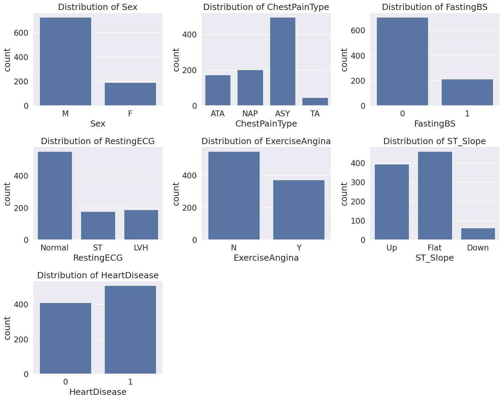
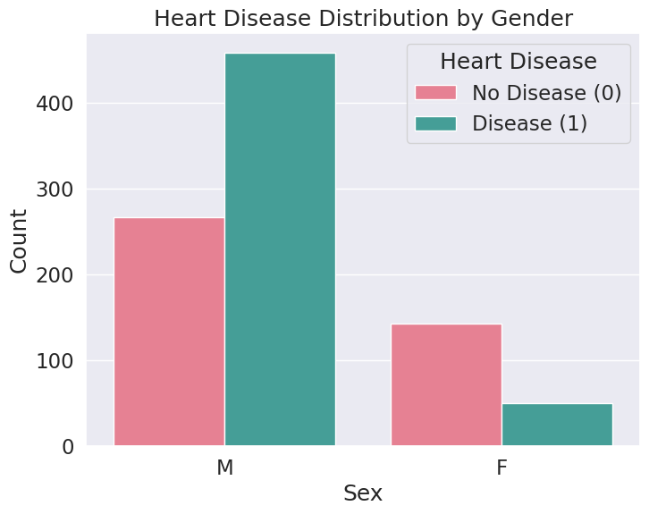
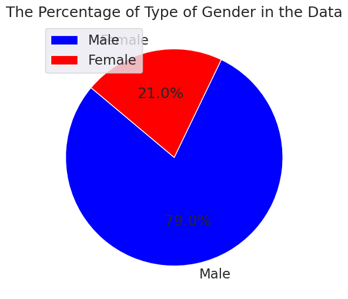

# Heart Attack Prediction Project

## Overview
This project aims to analyze heart-related health data and develop a machine learning model to predict the likelihood of a heart attack. The dataset is processed and analyzed using **Python**, with key findings visualized for better interpretation.

## Repository Contents
- **`Heart_Attack_Prediction_Project.ipynb`**: Jupyter Notebook containing data analysis, preprocessing, model training, and evaluation.
- **`heart.csv`**: The original dataset used for training and testing.
- **`processed_data.csv`**: Preprocessed dataset after feature selection and cleaning.
- **`imag1.png`, `image2.png`, `image3.png`**: Visualizations generated during data analysis.

## Visualizations
### Feature Distributions


### Heart Disease Distribution by Gender


### Gender Distribution in the Dataset


## Steps in the Notebook
1. **Data Loading**: Importing the dataset and understanding its structure.
2. **Exploratory Data Analysis (EDA)**: Identifying patterns, correlations, and missing values.
3. **Feature Engineering**: Cleaning and transforming data for better model performance.
4. **Model Training**: Implementing machine learning models for heart attack prediction.
5. **Evaluation**: Assessing model accuracy and performance metrics.
6. **Visualization**: Graphical representation of key insights.

## How to Use
1. Clone this repository:
   ```bash
   git clone https://github.com/yourusername/Heart_Attack_Prediction.git
   cd Heart_Attack_Prediction
   ```
2. Install dependencies:
   ```bash
   pip install -r requirements.txt
   ```
3. Open the Jupyter Notebook:
   ```bash
   jupyter notebook Heart_Attack_Prediction_Project.ipynb
   ```

## Requirements
- Python 3.x
- Jupyter Notebook
- Pandas
- NumPy
- Matplotlib
- Seaborn
- Scikit-learn

## Results
The project explores key risk factors for heart attacks and builds a predictive model with insights visualized in the included images.

## Contributions
Feel free to contribute by submitting **issues** or **pull requests**.

